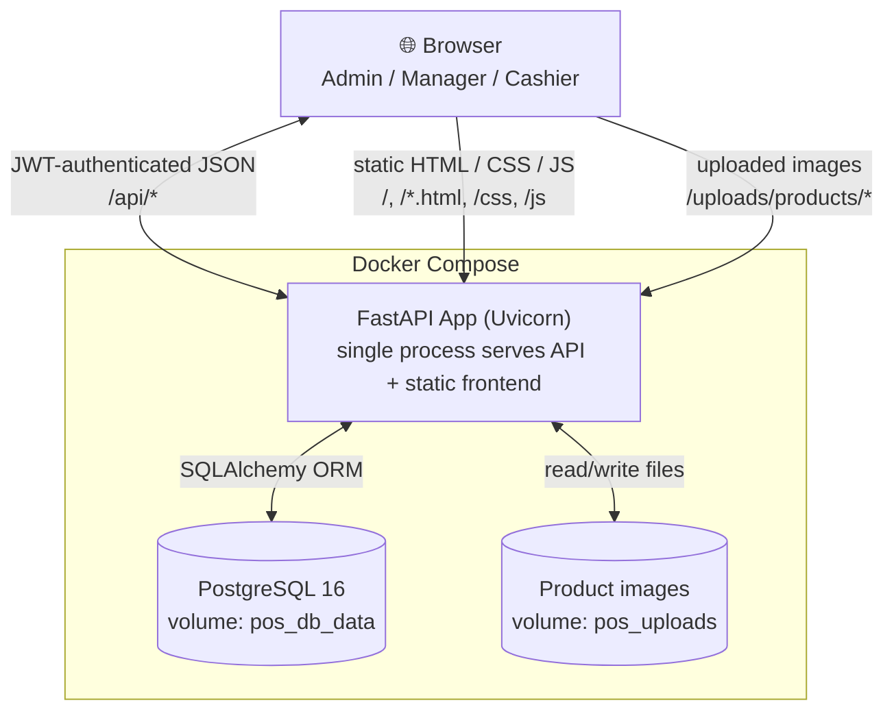
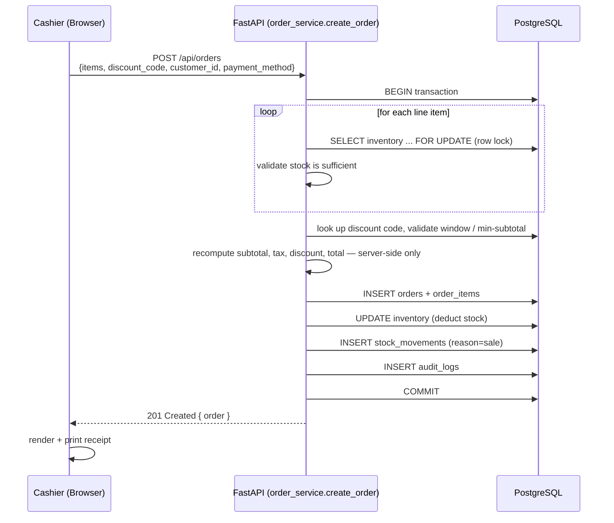
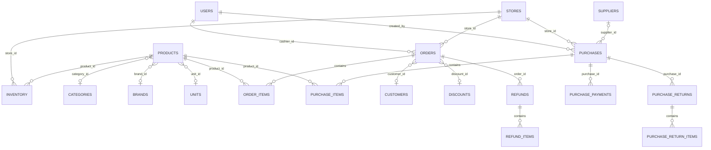

# DokanPro

A full-featured, multi-store retail management system — point of sale, inventory,
purchasing, suppliers, customers, expenses, and reporting — built with **FastAPI +
PostgreSQL** on the backend and **vanilla JavaScript** on the frontend (no build step,
no framework, runs anywhere Docker runs).

"Dokan" (দোকান) means "shop" in Bengali/Hindi/Urdu — the app includes native support
for Bangladeshi mobile payment methods (bKash, Nagad, Rocket) alongside cash and card.

**Full documentation:** open [`docs/index.html`](docs/index.html) in a browser — architecture, multi-tenancy, database schema, API reference, payments, roles &amp; permissions, security hardening, deployment, design system, and current project status.

---

## Table of Contents

- [Feature Overview](#feature-overview)
- [Roles & Permissions](#roles--permissions)
- [Tech Stack](#tech-stack)
- [Architecture](#architecture)
- [Request Flow: A Checkout, End to End](#request-flow-a-checkout-end-to-end)
- [Database Schema](#database-schema)
- [Project Structure](#project-structure)
- [Getting Started](#getting-started)
- [Default Accounts](#default-accounts)
- [API Overview](#api-overview)
- [Key Design Decisions](#key-design-decisions)
- [Known Limitations & Roadmap](#known-limitations--roadmap)
- [Deployment Notes](#deployment-notes)

---

## Feature Overview

### Dashboard & Reporting
- Role-aware landing dashboard: today / yesterday / month-to-date sales and profit, low-stock and expiring-stock counts, a 14-day sales chart, top-selling products.
- Full Reports page: daily sales, top products, sales by cashier, low-stock, expiring products, and a **Profit & Loss** breakdown (gross sales → discounts → refunds → net revenue → COGS → gross profit → expenses → net profit → margin %).
- CSV and PDF export on every report and on the inventory list.
- In-app notification bell: combined low-stock + expiring-stock alerts.

### Point of Sale (Checkout)
- Cart-based checkout screen with product search and **camera barcode scanning** (via the device camera, matching against product SKUs).
- Discount codes (percentage or fixed, with min-subtotal and date-window rules), validated and computed **server-side only**.
- Customer lookup/attach at checkout, with a quick-add flow for walk-in customers.
- Multiple payment methods: Cash, Card, **bKash, Nagad, Rocket**, Mobile, Other — with an optional transaction ID field for mobile-banking payments.
- **Hold / Resume Sale**: park a cart (with customer and discount attached) to serve another customer, and resume it later from any terminal.
- Real receipt printing (browser print dialog, not just an on-screen modal) — both immediately after checkout and as a reprint from Order History.

### Inventory & Products
- Products with SKU, category, brand, unit, price, cost, tax rate, expiry date, and an **uploaded product image**.
- Barcode label printing: pick products, set quantities, print a sheet of CODE128 barcode labels.
- Per-store stock levels, low-stock and expiring-stock views.
- **Stock History**: a full, filterable ledger of every inventory movement (sale, refund, purchase, purchase return, transfer, manual adjustment) with who did it and when.
- Manual stock adjustment with a reason and reference note.

### Purchasing & Suppliers
- Record purchases from suppliers (multi-line, with discount and tax), which atomically increases inventory and logs stock movements.
- **Purchase Returns**: return specific quantities of specific items back to a supplier, restocking correctly.
- **Supplier payment tracking (accounts payable)**: record partial/full payments against a purchase invoice; see Paid/Due per purchase and a running Due Amount per supplier.

### Sales Returns
- Item-level returns from Order History: return specific quantities of specific items (not just a blanket refund amount), which restocks inventory precisely and computes the refund from the order's own recorded prices — never a client-supplied amount.

### Multi-Store
- `Store` and `Inventory` are store-scoped throughout the schema.
- **Stock Transfers**: move quantities of a product between two stores atomically (row-locked to avoid deadlocks/oversells), with a transfer history log.

### Customers
- Customer directory with phone/email, loyalty points (manually adjustable), and computed lifetime **total spent** / **last purchase** from real order history.

### Expenses
- Record business expenses by category, filterable by date range, with a running total.

### Settings
- Business name, address, currency symbol, default VAT rate, and receipt footer — all editable and reflected live across receipts and every money value in the app.
- Brand and Unit catalogs for product tagging.

### Users & Granular Permissions
- Three base roles — `admin`, `manager`, `cashier` — each with sensible default capabilities.
- **Per-user permission overrides**: an admin can grant *or* deny any of 13 named capabilities (e.g. "Process Refunds", "View Profit Reports", "Manage Purchases") for one specific user, independent of their role — enforced at the API layer, not just hidden in the UI.
- Employee profile fields on users: phone, position, hire date, salary.

### Audit Trail
- Every checkout, refund, login, stock adjustment, and admin action is recorded in an append-only audit log.

---

## Roles & Permissions

| Capability key | What it gates | Admin | Manager | Cashier |
|---|---|:---:|:---:|:---:|
| `products.manage` | Products, categories, brands, units | ✅ | ✅ | ❌ |
| `inventory.adjust` | Manual stock adjustments | ✅ | ✅ | ❌ |
| `discounts.manage` | Discount codes | ✅ | ✅ | ❌ |
| `customers.manage` | Edit customers / loyalty points | ✅ | ✅ | ❌ |
| `suppliers.manage` | Supplier records | ✅ | ✅ | ❌ |
| `purchases.manage` | Purchases, purchase returns, supplier payments | ✅ | ✅ | ❌ |
| `transfers.manage` | Stock transfers between stores | ✅ | ✅ | ❌ |
| `expenses.manage` | Business expenses | ✅ | ✅ | ❌ |
| `stores.manage` | Store locations | ✅ | ✅ | ❌ |
| `orders.refund` | Process sales returns/refunds | ✅ | ✅ | ❌ |
| `reports.profit` | Dashboard + profit/loss reports | ✅ | ✅ | ❌ |
| `users.manage` | User accounts & permission overrides | ✅ | ❌ | ❌ |
| `settings.manage` | Business-wide settings | ✅ | ❌ | ❌ |

Every cashier and every manager can still use Checkout and view Order History — those
aren't permission-gated, since every role needs them to do their job.

**How overrides work:** each user has an optional `permission_overrides` JSON map. If a
key is present, it wins (`true` = force-allow, `false` = force-deny) regardless of role.
If absent, the role's default (table above) applies. This is enforced in
`app/core/permissions.py::has_permission()` on the backend (the real security boundary)
and mirrored in `frontend/js/api.js::hasPermission()` for nav visibility and page gates.

Example: to let one specific cashier process refunds without promoting them to manager,
grant that user `orders.refund: true` on the Users page — nobody else's access changes.

---

## Tech Stack

| Layer | Technology |
|---|---|
| Backend | Python 3.12, FastAPI, SQLAlchemy 2.0, Pydantic v2 |
| Database | PostgreSQL 16 |
| Auth | JWT (`python-jose`) + bcrypt password hashing |
| Frontend | Vanilla JavaScript, HTML, CSS — no build step, no framework |
| Charts | Chart.js (CDN) |
| Barcodes | `html5-qrcode` (scanning, CDN), `JsBarcode` (label printing, CDN) |
| PDF/CSV export | `fpdf2`, Python `csv` |
| File storage | Local disk, Docker named volume (`pos_uploads`) |
| Containerization | Docker Compose (`db` + `backend` services) |
| Migrations | Alembic (scaffolded — see [Known Limitations](#known-limitations--roadmap)) |

---

## Architecture



The backend is a **single FastAPI process** that does double duty: it serves the JSON
API under `/api/*` *and* serves the frontend's static HTML/CSS/JS directly (see
`app/main.py`) — there's no separate frontend server, build step, or reverse proxy
required to run this locally. `docker-compose.yml` bind-mounts `./frontend` read-only
into the backend container so frontend edits are reflected without a rebuild.

---

## Request Flow: A Checkout, End to End

This is the most safety-critical path in the app — it's worth seeing in full, since it
illustrates the concurrency and trust model used throughout (discounts, purchases,
transfers, and returns all follow the same pattern: lock → validate → mutate → log →
commit, in one transaction).



If stock is insufficient or the discount code is invalid, the transaction is rolled
back entirely — no partial stock deduction ever happens. The client never sends prices
or totals; it only sends product IDs, quantities, and a discount code. Every price
shown to the customer is recalculated from the current product record at checkout time.

---

## Database Schema

25 tables in total. The core relational backbone:



The remaining tables are mostly standalone or simple lookups, not part of the core
graph above:

| Table | Purpose |
|---|---|
| `inventory` | Current quantity + reorder level per product **per store** |
| `stock_movements` | Append-only ledger of every stock change (the source of truth for *why* `inventory.quantity` is what it is) |
| `stock_transfers` | Record of stock moved between two stores |
| `expenses` | Business expenses by category and date |
| `held_sales` | Parked carts (cart contents stored as JSON — see [Key Design Decisions](#key-design-decisions)) |
| `business_settings` | Singleton row: business name, currency, default VAT, receipt footer |
| `audit_logs` | Append-only record of every sensitive action (who, what, when) |
| `users` | Includes `role`, `permission_overrides` (JSON), and employee profile fields |

---

## Project Structure

```
pos-system/
├── backend/
│   ├── app/
│   │   ├── main.py              # FastAPI app, router registration, static file serving
│   │   ├── seed.py              # creates tables + demo data on first run
│   │   ├── core/
│   │   │   ├── config.py        # env-driven settings (DATABASE_URL, SECRET_KEY, CORS)
│   │   │   ├── security.py      # JWT + password hashing
│   │   │   ├── deps.py          # get_current_user
│   │   │   ├── permissions.py   # permission catalog, role defaults, require_permission()
│   │   │   └── uploads.py       # product-image storage paths
│   │   ├── db/                  # SQLAlchemy engine/session/Base
│   │   ├── models/              # ORM models (one file per domain)
│   │   ├── schemas/             # Pydantic request/response models
│   │   ├── api/                 # route handlers, one router per domain
│   │   └── services/            # transactional business logic (checkout, purchases, transfers, discounts, audit, export)
│   ├── alembic/                 # migration scaffolding (not yet the live migration path)
│   ├── requirements.txt
│   └── Dockerfile
├── frontend/
│   ├── index.html               # login
│   ├── dashboard.html           # role-aware landing dashboard
│   ├── pos.html                 # checkout screen
│   ├── inventory.html           # products, stock, images, expiry
│   ├── stock-history.html       # stock movement ledger
│   ├── labels.html              # barcode label printing
│   ├── customers.html
│   ├── discounts.html
│   ├── suppliers.html
│   ├── purchases.html           # purchases, returns, supplier payments
│   ├── stores.html
│   ├── transfers.html
│   ├── expenses.html
│   ├── orders.html              # order history, returns, receipt reprint
│   ├── reports.html             # sales, profit & loss, exports
│   ├── users.html                # user management + permissions matrix
│   ├── settings.html
│   ├── css/style.css
│   └── js/                       # one file per page + shared api.js (auth, nav, permissions, exports)
├── docker-compose.yml
└── README.md
```

---

## Getting Started

### Docker (recommended)

```bash
docker compose up --build
```

Then open **http://localhost:8000**. The `backend` service runs the seed script on
startup automatically, creating the demo accounts below. Uploaded product images
persist across rebuilds via the `pos_uploads` named volume; database data persists via
`pos_db_data`.

### Without Docker

```bash
# 1. PostgreSQL
createuser pos_user --pwprompt
createdb pos_db -O pos_user

# 2. Backend
cd backend
python -m venv venv && source venv/bin/activate
pip install -r requirements.txt
cp .env.example .env            # edit DATABASE_URL / SECRET_KEY
python -m app.seed              # creates tables + demo data
uvicorn app.main:app --reload --port 8000
```

The app (backend **and** frontend) is now served entirely from
**http://localhost:8000** — no separate frontend server needed.

---

## Default Accounts

| Role | Email | Password |
|---|---|---|
| Admin | admin@possystem.dev | admin123 |
| Manager | manager@possystem.dev | manager123 |
| Cashier | cashier@possystem.dev | cashier123 |

**Change these before deploying anywhere real.**

---

## API Overview

All endpoints are under `/api`. Interactive Swagger docs are at
**http://localhost:8000/docs**; the OpenAPI title is "DokanPro API".

| Router | Key endpoints |
|---|---|
| `auth` | `POST /auth/login`, `GET /auth/me` |
| `users` | `GET/POST /users`, `PATCH /users/{id}`, `GET /users/permissions` |
| `products` | `GET/POST /products`, `PATCH/DELETE /products/{id}`, `POST/DELETE /products/{id}/image`, `/products/categories`, `/products/brands`, `/products/units` |
| `inventory` | `GET /inventory`, `/low-stock`, `/movements`, `POST /inventory/adjust`, `/export` |
| `orders` | `GET/POST /orders`, `GET /orders/{id}`, `POST /orders/{id}/refund` |
| `discounts` | `GET/POST /discounts`, `PATCH/DELETE /discounts/{id}`, `GET /discounts/lookup/{code}` |
| `customers` | `GET/POST /customers`, `PATCH/GET /customers/{id}` |
| `suppliers` | `GET/POST /suppliers`, `PATCH/GET /suppliers/{id}` |
| `purchases` | `GET/POST /purchases`, `GET /purchases/{id}`, `POST /purchases/{id}/return`, `POST /purchases/{id}/payments` |
| `stores` | `GET/POST /stores`, `PATCH /stores/{id}` |
| `transfers` | `GET/POST /transfers` |
| `expenses` | `GET/POST /expenses`, `DELETE /expenses/{id}`, `GET /expenses/total` |
| `held_sales` | `GET/POST /held-sales`, `DELETE /held-sales/{id}` |
| `reports` | `/summary`, `/dashboard`, `/profit`, `/daily-sales`, `/top-products`, `/sales-by-cashier`, `/low-stock`, `/expiring` (+ `/export` on most) |
| `settings` | `GET/PATCH /settings` |

---

## Key Design Decisions

- **Row-locking on every stock mutation.** Checkout (`order_service.py`), purchases
  and purchase returns (`purchase_service.py`), and stock transfers
  (`transfer_service.py`) all lock the relevant `inventory` row(s) with
  `SELECT ... FOR UPDATE` inside a single transaction before validating and mutating
  stock. This is what prevents two concurrent sales from overselling the last unit, and
  what prevents a transfer from leaving stock in an inconsistent state if two transfers
  race on the same product.
- **Money as `NUMERIC(10,2)`**, never floats. Every total is recalculated server-side
  from current prices — the client only ever sends product IDs, quantities, and a
  discount code, never a price or total.
- **Orders and purchases are append-only.** A sales return or purchase return is a
  separate `Refund`/`PurchaseReturn` record referencing the original, with its own
  line items — the original order/purchase row is never mutated except its `status`.
- **`stock_movements` is the source of truth for *why*** inventory changed (sale,
  refund, purchase, purchase return, transfer, manual adjustment) — `inventory.quantity`
  is a denormalized running total kept in sync by every code path that touches stock.
  The Stock History page is just a read of this ledger.
- **Discounts are computed server-side from a `Discount` record looked up by code** —
  the checkout endpoint never trusts a client-supplied discount amount, closing what
  was originally a client-trusted field in an earlier iteration of this schema.
- **Held sales store cart contents as a JSON blob** (`held_sales.items`), not as
  relational rows — a parked cart isn't a real transaction yet (no inventory impact,
  no order record), so a lightweight JSON snapshot avoids modeling a whole parallel
  "draft order" table structure for a transient, pre-checkout concept.
- **Permission overrides are additive to role defaults, not a replacement for them.**
  `has_permission()` checks the user's override map first, falling back to the role's
  default set — so granting one capability to one cashier can never accidentally widen
  or narrow anything else about their access.
- **Product images live on disk, not in the database**, under a path derived from a
  UUID filename — only the URL is stored in Postgres. The upload directory is a named
  Docker volume specifically so images survive container rebuilds (unlike the app code,
  which is copied fresh into the image on every build).

---

## Known Limitations & Roadmap

Documenting these plainly rather than leaving them to be discovered:

- **No Alembic migrations in practice.** The seed script uses
  `Base.metadata.create_all()`, which creates *missing* tables but never alters
  existing ones. Every schema change made during this project's development required a
  manual `ALTER TABLE` (or, for Postgres enums, `ALTER TYPE ... ADD VALUE`) applied by
  hand against the running database. This is fine for local/disposable data; it is
  **not** safe against a real production database. Generating a proper Alembic
  baseline and switching to `alembic upgrade head` as the actual migration path should
  happen before this touches real business data.
- **Expiry tracking is per-product, not per-batch/lot.** A product has one expiry
  date; restocking the same SKU with a new batch that expires later means manually
  updating that one field. There's no concept of "5 units expiring Tuesday, 15 units
  expiring next month" — real batch/lot tracking with FEFO-aware stock deduction would
  be a materially larger feature.
- **Profit calculations use each product's *current* cost**, not a historical cost
  snapshot per sale. Changing a product's cost today retroactively changes profit
  figures for past sales. Fine for a quick P&L glance; not audit-grade accounting.
- **Client-side permission-gating isn't wired to every page.** The Users page,
  navbar visibility, and the Orders page's refund button are fully permission-aware.
  `stock-history.html` and `labels.html` still gate on role directly, since their
  underlying API endpoints were never permission-restricted in the first place (open to
  any authenticated user) — there's no permission key to map them to.
- **No real-time updates.** Two cashiers on different terminals won't see each other's
  stock changes or held sales until they reload the page — there's no websocket/polling
  layer.
- **Single currency, single tax regime.** `currency_symbol` and `default_vat_rate` are
  global settings, not per-transaction or per-region.

---

## Deployment Notes

For a free, no-credit-card deployment path: **Render** (web service, from the existing
`backend/Dockerfile`) + **Neon** (managed Postgres) both have genuine no-card-required
free tiers as of this writing. Since the backend serves the frontend itself, you only
need one Render service — no separate static site host. Key things to set:

- `DATABASE_URL` — Neon's connection string, with the SQLAlchemy driver suffix
  (`postgresql+psycopg2://...`) and `?sslmode=require` appended.
- `SECRET_KEY` — generate a real random secret; don't ship the default.
- Start command must bind to Render's `$PORT`, not the hardcoded `8000` in the
  Dockerfile: `sh -c "python -m app.seed && uvicorn app.main:app --host 0.0.0.0 --port $PORT"`.
- **Do the Alembic migration work (see above) before pointing this at real data** —
  Render's free web service is disposable/ephemeral by nature, but Neon's database
  is not, and hand-patching schema changes against a live production database is not
  a sustainable practice.

Render's free tier spins the service down after 15 minutes of inactivity (~1 minute
cold start on the next request) — fine for a small shop's actual usage pattern, not for
something needing instant always-on access.

## Database Backups

`backend/scripts/backup_db.sh` dumps the running `db` compose service to a timestamped
file under `backups/` (gitignored):

```bash
./backend/scripts/backup_db.sh
```

`backend/scripts/restore_db.sh <file>` restores one back — **destructive**, it drops and
recreates every table first, and asks for confirmation before doing anything:

```bash
./backend/scripts/restore_db.sh backups/pos_db_20260730_120000.sql
```

These are manual/cron-triggered only, not scheduled or shipped off-site. Most managed
Postgres hosts (including Neon, above) include automated backups on their free tier —
prefer that once you're on one, rather than relying solely on this script.
